# InvestoReady

An Android application that will display top 15 stocks (Selected by a stock market expert) and their analyzed data (P/B Ratio , P/E Ratio , Return on Equity , Dividend Yield , Debt to Equity and Net Profit Margin and Stock Prices from year 2006 to 2022). This application is mainly for beginners. The application also provides the user to automatically generate a portfolio and also provides a Return of Investment Calculator (ROI) for 2 stocks (as of 08/12/2022) namely TCS and Infosys

## Table of Contents

- [ Motivation ](#motivation)
- [ Screenshots ](#screenshots)
- [ Technology/Framework Used ](#technology)
- [ Algorithms ](#algorithms)
- [ Features ](#features)
- [ Code Examples ](#codeExamples)
- [ Installation ](#installation)
- [ How To Use ? ](#howToUse)
- [ API Reference ](#apireference)
- [ Credits ](#credits)
- [ License ](#license)

### Team

- [@Pratham-cymk](https://www.github.com/Pratham-cymk): Backend & Logic of App
- [@ram7203](https://github.com/ram7203): Frontend
- [@puneetmpatil](https://github.com/puneetmpatil): Backend & Logic of App

## <ins>Motivation</ins>

In recent times, investing is as important as earning. Financial literacy can allow a person to reach different level of heights. Investing is considered to be a risky task (particularly in stocks) because of which many people avoid it. Hence to make investing easy we are proposing this idea.

<!-- Screenshots to be added -->

### <ins>Screenshots</ins>
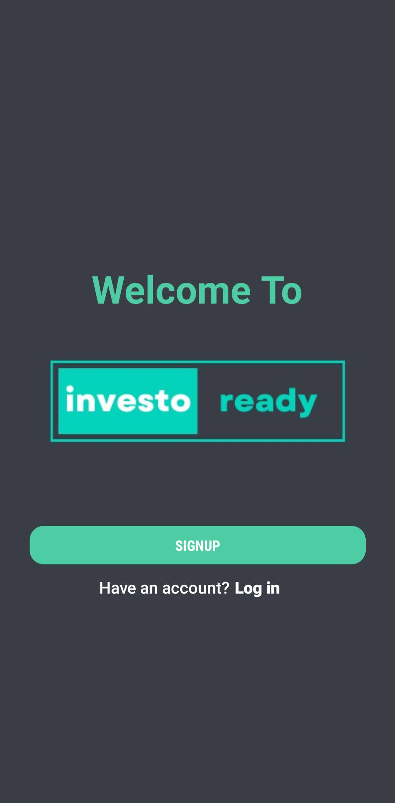

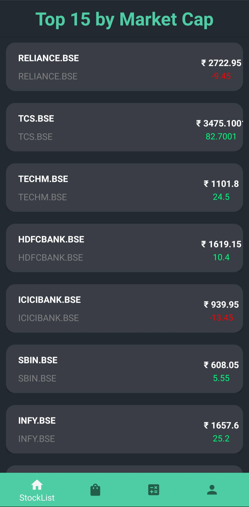
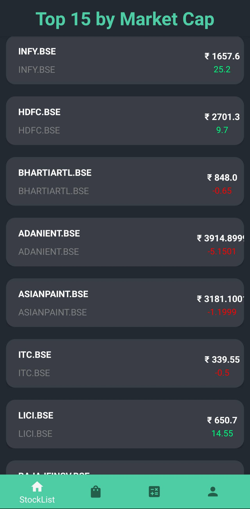
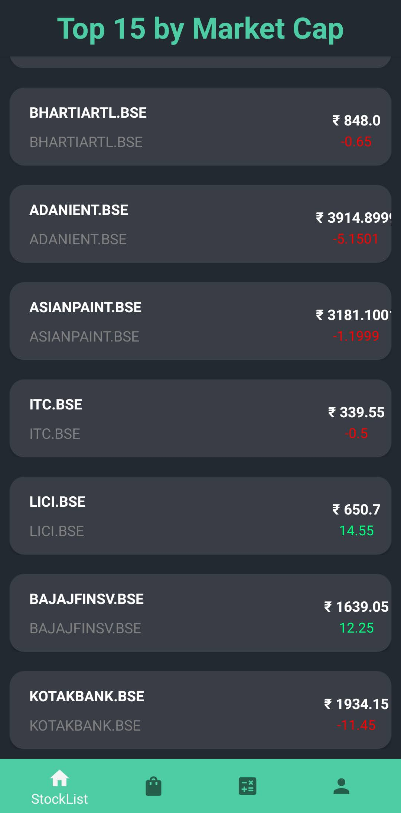
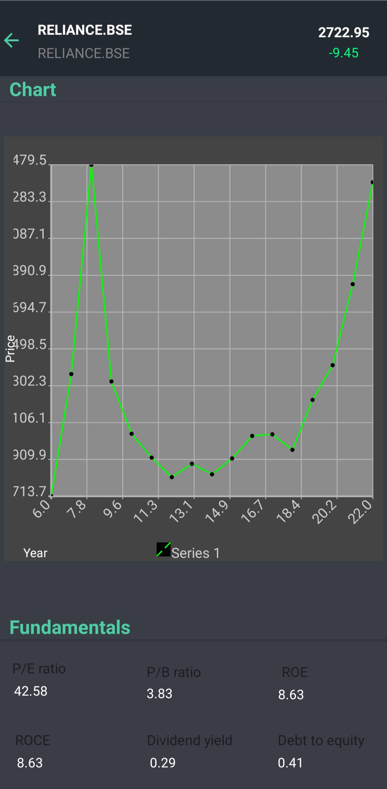
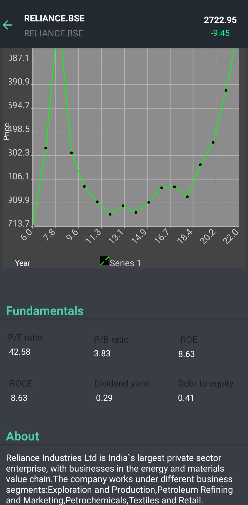
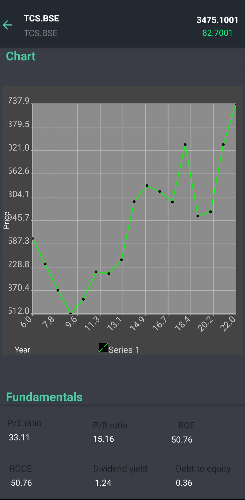
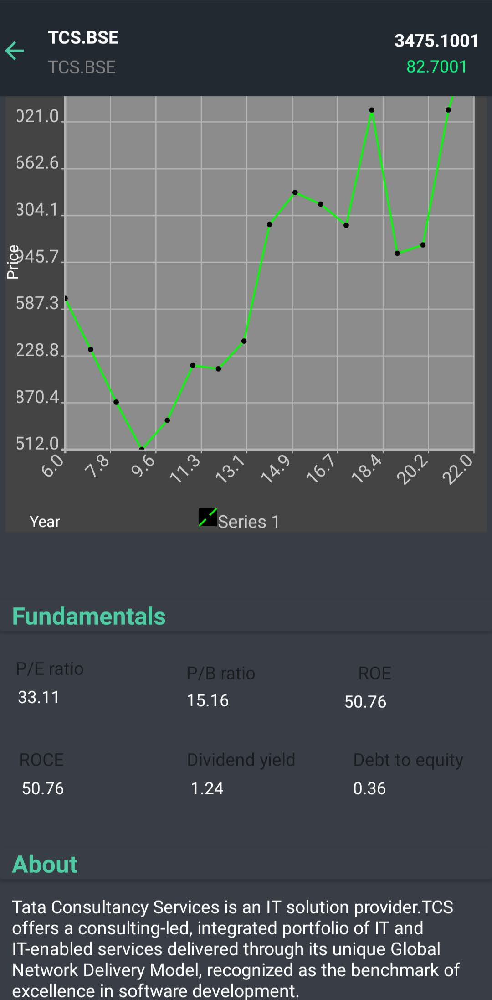
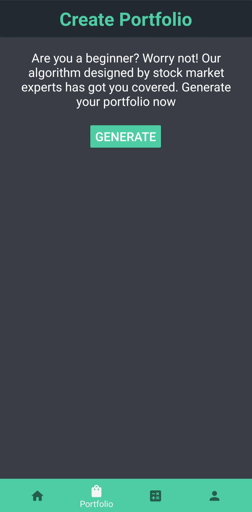
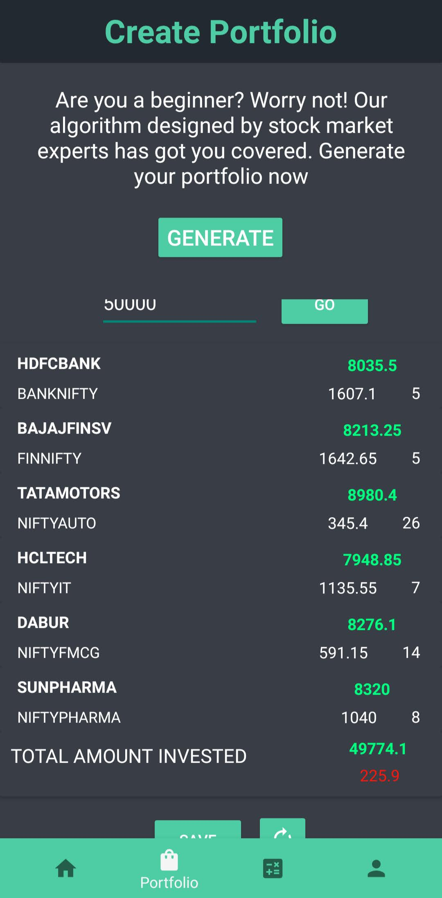
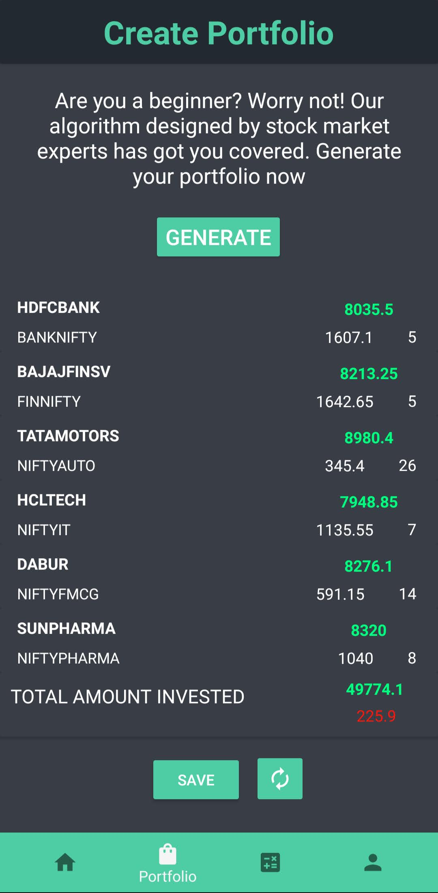
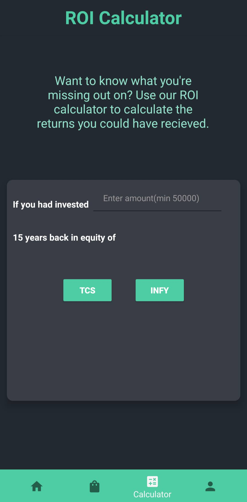

### <ins>Tech/ Framework used</ins>

<ins>IDES</ins>
 

<a href="https://developer.android.com/studio?gclid=EAIaIQobChMI-YHVttfW-wIVC5JmAh0shAucEAAYASAAEgJW8PD_BwE&gclsrc=aw.ds" target="_blank"><a href="https://code.visualstudio.com/" target="_blank"><a href="https://jupyter.org/" target="_blank">

<ins>Programming Languages</ins>
 
<a href="https://www.python.org/" target="_blank">

<ins>Database</ins>
 

<ins>Libraries</ins>
 

### <ins> Algorithms </a>

- [ ROI Calculator Algorithm ](#ROICalculator)
- [ Portfolio Generation Algorithm ](#portfolio)

<ins>**ROI Calculator Algorithm**</ins>

**Given :**

1. Bonus year array
2. Bonus year ratio factor array
3. Dividend factor
4. Price of stock with year varying from current year to base year

**Input :**

- Investment

**Output :**

- Total dividend received over no of years (current year - base year)
- Current evaluation

**Algorithm:**

<ol>
<li> Input amount to be invested from user</li>
<li> Let base year for calculation be 2006</li>
<li> Define an array which will store the bonus year of each stock and another array for bonus year ratio factor.
For example: TCS has offered 1:1 ratio of stocks in the years 2006, 2009 and 2018. It means that the quantity of stocks doubled in those years. </li>
<li> Define an array price which will contain prices from 2006 (base year) to 2022 (current year) in decreasing order of year</li>
<li>Define dividend factor of the stock</li>
<li>If the base year = 2006 and the current year = 2022, no of years = 17. Therefore number of financial years = 16</li>
<li>Find initial quantity of stocks</li>

**quantity = investment_amount/price(2006)**
<li>Initialize total dividend to zero</li>
<li>
for i := (no of years - 2) to 0 and year := (2006)
<ul>
<li>If year is a bonus year then multiply quantity of stocks by bonus_year_factor_ratio for that year</li>
<li>total_dividendent =  total_dividendent + quantity*((price[i]*dividendFactor)/100)</li>
<li>Increment value of year</li>
<li>Decrement value of i</li>
</ul>
<li>Output current evaluation and total dividend received

**current_valuation = (current_stock_price * quantity_of_stocks)**

</li>
</ol>

<ins>**Portfolio Generation Algorithm**</ins>

**Input :**
Budget / Investment amount

**Output :**

1. Total allocated amount
2. Sector-wise allocated amount
3. Quantity of stock sector-wise
4. Total remaining amount

**Algorithm:**
<ol>
<li>Input budget or amount to be invested from user (Minimum investment = 30000)</li>
<li>We assume the no. of sectors from which stocks will be allocated belong to be 6 and we select the top 3 best stocks from many stocks based on research by a team of experts.</li>
<li>Find the sector-wise amount to be allotted

**sectoralAmount = budget / noOfSectors**
</li> 
<li>We have the top 3 companies per sector wise along with their current prices with us</li>
<li>for i = 1 to noOfSectors 
<ol>
<li>Select a stock from each sector and find the quantity</li>
<li>

**quantity = sectoralAmount/(price_of_stock_randomly_selected)**
</li> 
<li>

**remainingAmountPerSector = sectoralAmount%(price_of_stock_randomly_selected)**
</li>
<li>

**totalAllocated = totalAllocated + (quantity * (price_of_stock_randomly_selected))**
</li>
</ol></li>
<li>

**totalRemaining = budget - totalAllocated**
</li>
<li>From each sector we find the stock with minimum price and that minimum price should be less than remaining amount</li>
<li>If no stock can be found which has price less than remaining amount then your portfolio has been generated</li>
<li>Else u find the additional quantity of stocks which can be bought using the remaining amount</li>
<li>Find total allocated amount and total remaining amount</li>
<li> Output the total allocated amount, sector-wise allocated amount, quantity of stock sector-wise and total remaining amount</li>
</ol>

### <ins>Features</ins>

<ol>
    <li>AI powered portfolio</li>
    <li>Return of Investment Calculator (ROI)</li>
</ol>

<!-- Code Examples -->

### <ins>Code Examples</ins>

<!-- Installation -->

### <ins>Installation</ins>

## <ins>API Reference</ins>

<a href="https://www.alphavantage.co/documentation/" target="_blank">Alpha Vantage</a>

<!-- How To Use ? -->

### <ins>How to use?</ins>

<!-- Credits -->

### <ins>Credits</ins>

- [Insert Data from Firebase using Python](https://youtu.be/DCaH4bQ4DxA)
- [Retrieve Data from Firebase using Android](https://www.geeksforgeeks.org/how-to-retrieve-data-from-the-firebase-realtime-database-in-android/)

###### <ins>License</ins>

<a href="/LICENSE">MIT License</a>
